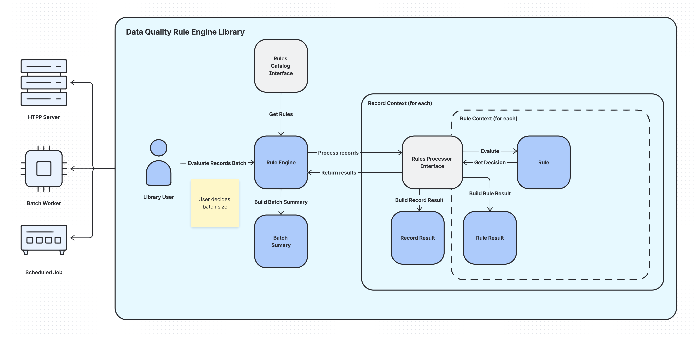

# 1. Functional Requirements

### 1.1 Core — validate a batch

- **F1 Make a Result for each rule.**
  - The engine reads a batch of records and the rule catalog.
  - The engine runs each applicable rule on each record.
  - When a rule produces an outcome, the engine makes one **Result**.
  - A **Result** carries the **decision** (`VALID`/`INVALID`/`REVIEW`/`NOT_APPLICABLE`), the rule's **severity** (`ERROR`/`WARNING`/`INFO`), and the **provenance**.
  - The provenance explains the decision: which rule, which record, and which field(s)/value(s) the rule read.
- **F2 Derive the decision through a declarative mapping, not if/else.**
  - A rule computes a **value** from the record's fields — for example `"blocked"` for a blocked country, or `"ok"`/`"bad"` for a format check.
  - A declarative **decision mapping** turns that value into a **decision** (e.g. `"blocked" → INVALID`), with a `default` for anything unmapped.
  - A decision is one of `VALID`, `INVALID`, `REVIEW`, `NOT_APPLICABLE`.
  - Keep the mapping as data. Do not hard-code the decision with if-then-else inside the rule.
- **F3 Isolate faults.**
  - A rule can fail: bad logic, a bad record, or a missing field.
  - When a rule fails, the engine records a per-rule / per-record **error** with enough detail to locate the cause.
  - One failure must not stop the batch or the run.
  - The caller receives both the results and the errors.
- **F4 Give a run summary.**
  - The number of results and the number of errors.
  - A breakdown of results by **decision** (how many `VALID`, `INVALID`, `REVIEW`, `NOT_APPLICABLE`).
  - A breakdown of results by **severity** (`ERROR`/`WARNING`/`INFO`).

### 1.2 Extended — scale and selection

- **F5 Process large volumes.**
  - The target is about 1,000,000 records per run.
  - Memory use must stay bounded regardless of total volume.
  - The engine emits each result as it is produced. It must not accumulate all results in one list.
  - The batch size is configurable by the caller.
- **F6 Select a subset of the rules.**
  - The caller restricts a run with composable filters that combine.
  - Filter by **status** (`DRAFT` / `RELEASED` / `DEPRECATED`).
  - Filter by **country scope**: a rule applies when its scope is `WORLD` or its country equals the record's country.
  - Filter by **category** (a rule has zero or more categories).
  - Whatever the filters select, the engine runs `RELEASED` rules only.

# 2. Non-functional requirements

- Plain Java 21 (or later).
- Build with Gradle.
- Keep the source in GitHub with a sensible commit history.
- Choose your own tools and libraries.
- *Other non-functional requirements were deliberately left out — consider what else a good library is expected to provide.*

# 3. Domain Model

### 3.1 Record

```json
{
  "id": "r1",
  "vatId": "DE111111111",
  "country": "DE",
  "legalName": "ACME GmbH",
  "iban": "DE123456789"
}
```

### 3.2 Rule

```json
{
  "id": "<uuid>",
  "label": "<human-readable-label>",
  "status": "RELEASED|DRAFT|DEPRECATED",
  "severity": "ERROR|WARNINR|INFO",
  "countryScope": "DE|PL|null",
  "categories": [],
  "decisionMapping": {
    "<rule-result>": "<decision>",
    "<rule-result2>": "<decision2>"
  },
  "defaultDecision": "<decision3>"
}
```

### 3.3 Decision

```java
public enum Decision {
    VALID,
    INVALID,
    REVIEW,
    NOT_APPLICABLE
}
```

### 3.4 Rule Result

```json
{
  "ruleId": "rule1",
  "outcome": "blocked",
  "decision": "VALID",
  "severity": "WARNING",
  "success": "true|false",
  "provenance": {
    "<field>": "<validation-details>",
    "<field2>": "<validation-details2>"
  }
}
```

### 3.5 Record Result

```json
{
  "id": "<uuid>",
  "recordId": "<uuid>",
  "ruleResultsSuccess": [
    {
      "//": "rule result 1"
    },
    {
      "//": "rule result 2"
    }
  ],
  "ruleResultsFailure": [
    {
      "//": "failed rule result 1"
    }
  ]
}
```

### 3.6 Batch Summary

```json
{
  "ruleResultsSuccess": "<number>",
  "ruleResultsFailure": "<number>",
  "ruleResultsByDecision": {
    "INVALID": "<number>",
    "NOT_APPLICABLE": "<number>",
    "VALID": "<number>"
  },
  "ruleResultsBySeverity": {
    "WARNING": "<number>",
    "ERROR": "<number>"
  }
}
```

### 3.7 Batch Result

```json
{
  "batchSummary": "<summary>",
  "recordResults": [
    {
      "//": "r1 result"
    },
    {
      "//": "r2 result"
    },
    {
      "//": "r3 result"
    }
  ]
}
```

# 4. Solution Architecture



# 5. Solution Details

- **Rule Engine** exposes operation to process batch of records:
  - fetches rules and applies filters to select subset of rules (**F1, F6**)
  - for each record executes rules via Rule Processor (**F1**)
  - client decides batch size, rule engine accepts the batch, to enable scale (**F5**)
  - since it’s a library, it is detached from any technology — can be used with Spring WebFlux, RxJava, Parallel Collectors (Virtual Threads)
  - builds the summary of batch processing including number of errors and successes (**F3, F4**)
- **Rules Processor** is processing a single record against all rules, allowing fault-tolerant processing:
  - when a rule produces an outcome, uses declarative mapping to derive a decision (**F1, F2**)
  - creates a rule result that carries the decision, severity and provenance (**F1**)
  - isolates faults; one error/failure doesn’t stop processing the batch (**F3**)
- **Rule** is a self-contained class with:
  - logic to evaluate — compute outcome
  - decision map
  - provides provenance explaining decision (**F1**)
- Each **Rule** processing produces a **Rule Result** (**F1, F2**)
- Each **Record** processing produces a **Record Result**, isolating successful and failed processing (**F3**)
- Each **Batch** produces a **BatchResult**, including summary and records results

# 6. Assumptions, Trade-offs and Decisions

### 6.1 Bounded Memory

Rule Engine works on batch of data (already split), this enables to keep the library technology detached while still keeping it memory bounded. Please see demo for usage example.

### 6.2 Fault Isolation

Rule evaluation is isolated inside processRule(). Each invocation produces either a successful RuleResult or a failed RuleResult; exceptions never escape the rule boundary. Error handling can be extended to provide specific handling for exceptions, use custom errors classes, etc.

### 6.3 Record Schema-less

Each **Record** is processed as `Map<String, Object>` to allow schema-less extensibility.

### 6.4 Rule Caching

There is no rule-caching since it’s statically loaded. This could be extended in the future.

### 6.5 Provenance

**F1** states:

> The provenance explains the decision: which rule, which record, and which field(s)/value(s) the rule read.

Decided to only record field/value processing since rule and record information is already contained in **RecordResult** and **RuleResult**.
Provenance could also be improved further e.g. dedicated class, field name control, etc.

### 6.6 Status Filter

It has been explicitly requested to ignore the status filter (**F6.5**) and always return `RELEASED` rules:

```java
.filter(rule -> rule.getStatus() == RELEASED)
```

The filter actual implementation would look like:

```java
.filter(rule -> isNull(filterByStatus) || filterByStatus == rule.getStatus())
```

# 7. Ideas and Future Improvements

### 7.1 Rules

**Rule** has evaluate logic and declarative mapping to get a decision. This could be extended to abstract away any logic into conditions, for example:

```json
{
  "id": "",
  "label": "countryBlocked",
  "status": "RELEASED",
  "severity": "ERROR",
  "country": null,
  "categories": [],
  "decision": "INVALID",
  "condition": {
    "type": "NESTED",
    "operator": "AND",
    "conditions": [
      {
        "type": "SIMPLE",
        "field": "$.country",
        "operator": "EXISTS"
      },
      {
        "type": "SIMPLE",
        "field": "$.country",
        "operator": "EQUALS",
        "value": "ZZ"
      }
    ]
  }
}
```

### 7.2 Rule Processor

Rule Processor executes all the rules and returns all rule processing results.

This could be extended if the final decision should be a combination of rule decisions.

**Example 1: Priority Rules Processor**

```json
[
  {
    "rule": "countryBlock",
    "priority": 3,
    "decision": "INVALID"
  },
  {
    "rule": "premierCompany",
    "priority": 2,
    "decision": "VALID"
  },
  {
    "rule": "ibanBlock",
    "priority": 1,
    "decision": "INVALID"
  }
]
```

**Priority Rules Processor** can execute all rules from highest to lowest priority. The first rule whose conditions are met is the “winning” rule and determines the final decision.

For example, if the company is `premierCompany`, then the result of the `ibanBlock` rule is ignored.

**Example 2: Pessimistic Rules Processor**

```json
[
  {
    "rule": "countryBlock",
    "decision": "INVALID"
  },
  {
    "rule": "vatValidation",
    "decision": "REVIEW"
  }
]
```

**Pessimistic Rules Processor** can execute all rules and take the worst decision from all rules whose conditions are met.

For example, if both rules are triggered, the final decision is `INVALID` since it is more severe than `REVIEW`.

**Example 3: Weighted Rules Processor**

```json
[
  {
    "rule": "checkCountry",
    "score": "200"
  },
  {
    "rule": "checkIban",
    "score": "-100"
  },
  {
    "rule": "checkTrustedVat",
    "score": "120"
  }
]
```

**Weighted Rules Processor** can execute all rules and sum the score of all rules whose conditions are met. The final decision can be based on score thresholds.

For example, if `checkCountry` and `checkTrustedVat` are triggered, the final score is above the 300 threshold, which makes the decision `VALID`.

### 7.3 Rules Catalog

Provides static rules living within the library — this could be extended in the future to use a external application e.g. **rules store**.

